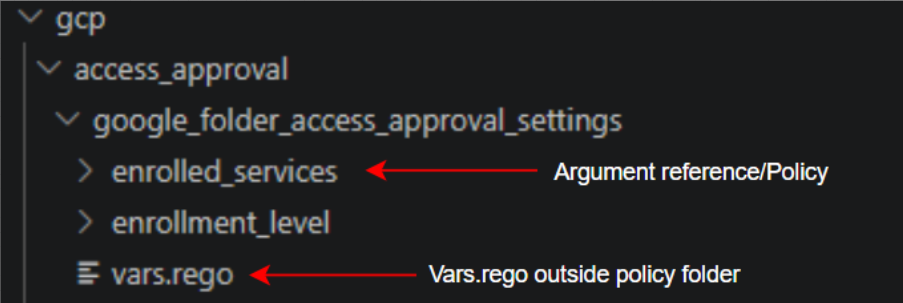

<h1 align="center">Policy Writing</h1>

## Folder Structure

Set up the correct folder structure for your service. Each resource type has its own folder
under both `inputs/gcp` and `policies/gcp`. Note the two trees differ: in `inputs/` each
attribute gets its **own subfolder** (holding the fixtures), while in `policies/` each
attribute is a **flat `<attribute>.rego` file** inside the resource folder.

### 1. Create a folder for your service and resource type

Navigate to `inputs/gcp` and create a folder for your service

Inside this folder, create a new folder for your resource type based on Terraform.

Repeat the same steps in `policies/gcp`:

### 2. Add the attribute (policy) to each tree

When you have determined that an argument reference has security relevance:

- In `inputs/`, create a folder for it (this holds the fixtures):

  `inputs/gcp/<Service>/<resource type>/<attribute>/`

- In `policies/`, add a flat policy file (there is **no** per-attribute folder here):

  `policies/gcp/<Service>/<resource type>/<attribute>.rego`

### Example: `runtime`

### Naming Convention

- **Service folders** mirror the docs taxonomy — use the existing `docs/gcp/<Service>` folder
  name verbatim (these may contain spaces/parentheses, e.g. `Cloud Functions`, `Cloud Run (v2 API)`).
- **Resource type folders** and **attribute names** must match the Terraform names **exactly**
  (lowercase with underscores, e.g. `google_cloudfunctions_function`, `available_memory_mb`).
- The lowercase underscore **service slug** (e.g. `cloud_functions`) is only used inside the
  Rego package name — not the folder name.

### Example: `cloud_functions`

#### Resource folders

## What files do you need in your folders?

### 1. Copy required files

Copy the fixture files from `templates/gcp` into your **inputs** attribute folder
`inputs/gcp/<Service>/<resource type>/<attribute>/`:
- `compliant.tf`
- `nonCompliant.tf`
- `config.tf`

For the **policies** tree:

- Copy **one** `_vars.rego` into the resource folder `policies/gcp/<Service>/<resource type>/`
  (one per resource, shared by all of its policies).
- Copy `templates/gcp/policy.rego` into that same resource folder and **rename it to
  `<attribute>.rego`** — one flat file per attribute (there is no per-attribute subfolder here).

### For example

  
  

<em>Inputs/gcp(left) and policies/gcp(right)</em>
 

[⬅️ Previous: Researching and Documentation](researching-and-documentation.md#top) &nbsp;&nbsp;&nbsp; | &nbsp;&nbsp;&nbsp;
[📘 Back to Contents](policy-writing-tutorial.md#top) &nbsp;&nbsp;&nbsp; | &nbsp;&nbsp;&nbsp;
[Next: compliant.tf & nonCompliant.tf ➡️](c-tf-and-nc-tf.md#top)

