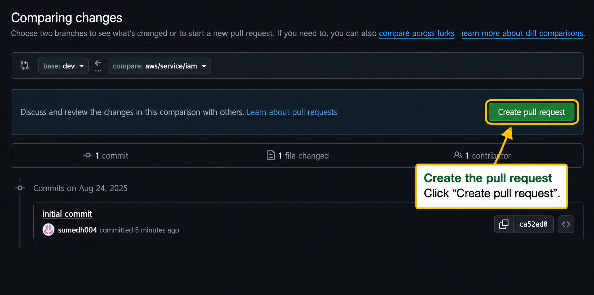

<h1 align="center">Raising a Pull Request</h1>

### 1. Push your changes

Add **only the files for your own resource** — not `git add .`, which sweeps up editor
scratch files, downloaded binaries and any file you were only looking at, and will fail the
`Branch scope` check on your pull request:

    git add "docs/gcp/<Service>/<resource type>.json" \
            "inputs/gcp/<Service>/<resource type>" \
            "policies/gcp/<Service>/<resource type>"

    git status          # check nothing else crept in

    git commit -m "message"  # e.g. initial commit

    git push origin <branch-name>  
    # e.g. git push origin Service/gcp/cloud_functions/google_cloudfunctions_function

### 2. Create a pull request

Navigate to the GitHub repository.

Click **"New pull request"**:

### 3. Select your branch

Find and select your pushed branch:

### 4. Create the pull request

Click **"Create pull request"**:

### 5. Add details

Add a clear title and description, then create the pull request:

### 6. Wait for checks and feedback

Your pull request must pass:

- OPA checks  
- Terraform checks  
- Lint checks — see [policy_lint](policy-lint.md#top)  
- **Branch scope** — your branch may only change files for its own resource type; see
  [branch_scope](branch-scope.md#top) if it fails  

Example:

### Important

- If checks fail, review your policies and fix any errors  
- Re-run tests locally before pushing again  
- If needed, reach out to a senior team member for help  

[⬅️ Previous: branch_scope — stay inside your own resource](branch-scope.md#top) &nbsp;&nbsp;&nbsp; | &nbsp;&nbsp;&nbsp;
[📘 Back to Contents](policy-writing-tutorial.md#top) &nbsp;&nbsp;&nbsp;  &nbsp;&nbsp;&nbsp;

