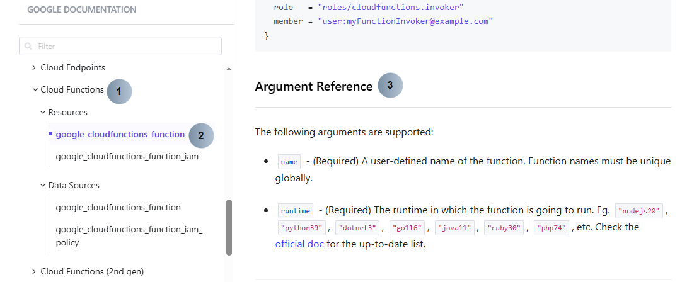
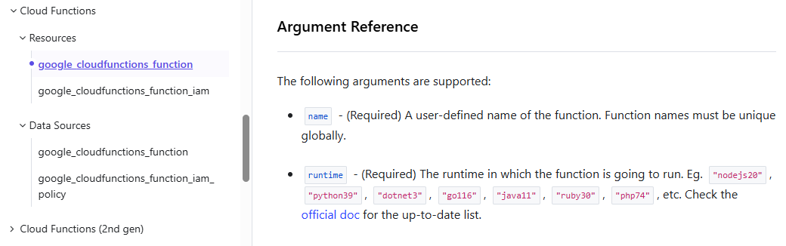
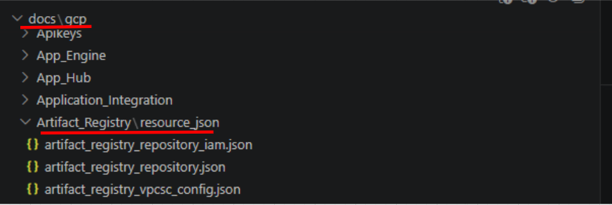

<a id="top"></a>
<h1 align="center">Researching and Documenting your Service</h1>


## Researching

### 1. Access the Terraform Registry

https://registry.terraform.io/providers/hashicorp/google/7.37.0/docs

> Use the provider version the repo is pinned to (see `scripts/auto_test/provider_version.txt`,
> currently `7.37.0`) so your arguments match what the test harness plans against.


### 2. Go to the argument reference of your service’s resource type



Policies are written based on the **arguments (3)** which are supported by your **service (1)** and **resource type (2)**.


### 3. Evaluate what arguments have a security impact

Research your service to determine whether its arguments are “security” related, meaning they have an impact on the security of the resource type, or the data contained.

For example:

 

Take this screenshot of the first two arguments which are supported for the **service – Cloud Functions**, and its first **resource type – google_cloudfunctions_function**.


### Argument 1

**Argument Name:** `name`

**Description:**  
“A user-defined name of the function. Function names must be unique globally.”

**Security impact:** ❌ No  

**Reasoning:**  
This argument only affects the identifier of the function and does not impact data, access, or the security of the resource type.


### Argument 2

**Argument Name:** `runtime`

**Description:**  
“The runtime in which the function is going to run”

**Security impact:** ✅ Yes  

**Reasoning:**  
Different runtimes have varying vulnerability exposure and patch histories, and older runtimes may be deprecated or no longer receive security updates, as shown in the [official documentation](https://docs.cloud.google.com/functions/docs/runtime-support#runtimes).

## Documenting your Service

To document your service, navigate to the `docs/gcp/<service>` directory. Each resource type will have its own `.json` file.




### Key Components to Complete

Each argument under the `arguments` object in the JSON file contains the following fields:

#### description
- Pulled from the Terraform provider schema by default  
- Update if needed to improve clarity or accuracy  


#### required
- Indicates whether the argument is required (`true` or `false`)  
- Generated from the provider schema  


#### type
- The Terraform type of the argument (e.g. `string`, `number`, `bool`)  
- Generated from the provider schema — leave it as produced  


#### security_impact
- Set to `true` if the argument affects security  
- Set to `false` if it has no security relevance  


#### rationale
- Explain **why** the argument does or does not have a security impact  
- Keep it simple and clear  

Example:

    "Display name has no impact on the security of the resource type or data."

### Important Notes

- Not all arguments require policies  
- You must justify (in `rationale`) why an argument does not need a policy  
- Use the Terraform Registry as your primary reference  
- Nested block arguments appear as **dotted keys** (e.g. `service_config.ingress_settings`)  


### Key Idea

Documentation should clearly show:
- What the argument does  
- Whether it is required  
- Whether it impacts security  
- Why a policy is or is not needed

### 🏗️ Generate the resource JSON

The docs JSON is generated from the Terraform **provider schema** by the docgen tool — you
don't hand-write the skeleton, and there is no separate Markdown-generation step. There is
one JSON file per resource at `docs/gcp/<Service>/<resource>.json`.

- Create JSON for resources that don't have one yet (existing files are left untouched):

```bash
python3 scripts/docgen/generator.py --csp gcp --mode identify-new --service "<Service>"
```

- Refresh existing files against the pinned provider version (recomputes arguments while
  preserving your `security_impact` / `rationale` edits):

```bash
python3 scripts/docgen/generator.py --csp gcp --mode refresh-existing --service "<Service>"
```

Then open each generated `docs/gcp/<Service>/<resource>.json` and fill in `security_impact`
and `rationale` for every argument.

### ✅ Example Workflow

1. Get assigned `Cloud Functions` from PDE Leadership.  
2. Generate its JSON:

```bash
python3 scripts/docgen/generator.py --csp gcp --mode identify-new --service "Cloud Functions"
```
3. Open the generated files under `docs/gcp/Cloud Functions/` (e.g. `google_cloudfunctions_function.json`).  
4. Fill in `security_impact` and `rationale` for each argument.  

### ⚠️ Notes & Best Practices

- **Don't hand-create the JSON skeleton or new folders** — docgen produces them from the schema.  
- **Only edit `security_impact` and `rationale`** — `description`, `required`, and `type` come from the provider schema.  
- **Booleans must be `true`/`false`** (not strings).  
- **Nested arguments** appear as dotted keys (e.g. `service_config.ingress_settings`) — edit them in place, don't restructure.  


---

<div align="center">

[⬅️ Previous: Prerequisites](./prerequisite.md#top) &nbsp;&nbsp;&nbsp; | &nbsp;&nbsp;&nbsp;
[📘 Back to Contents](policy-writing-tutorial.md#top) &nbsp;&nbsp;&nbsp; | &nbsp;&nbsp;&nbsp;
[Next: Policy Writing ➡️](policy-writing.md#top)

</div>

